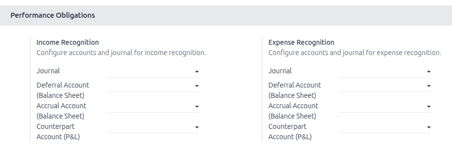

## Prerequisites

The user must belong to the **Show Full Accounting Features** group.

## Settings

Go to *Invoicing > Configuration > Settings*.

Under the **Performance Obligations** section, configure the following for each
obligation type (income / expense):

- **Recognition journal**: journal used to post recognition entries.
- **Deferral account**: balance-sheet account for deferred income/expense.
- **Accrual account**: balance-sheet account for accrued income/expense.
- **Counterpart account (P&L)**: default P&L account for recognition entries.

> **Note:** The P&L counterpart account can be overridden on individual
> obligations via the **P&L Recognition Account** field on the obligation form.
