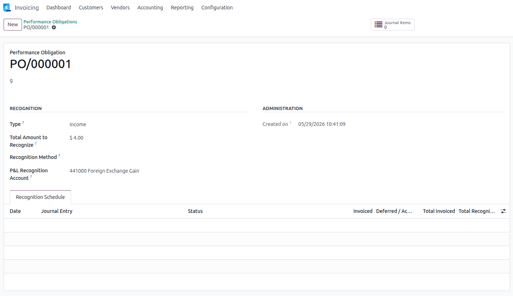
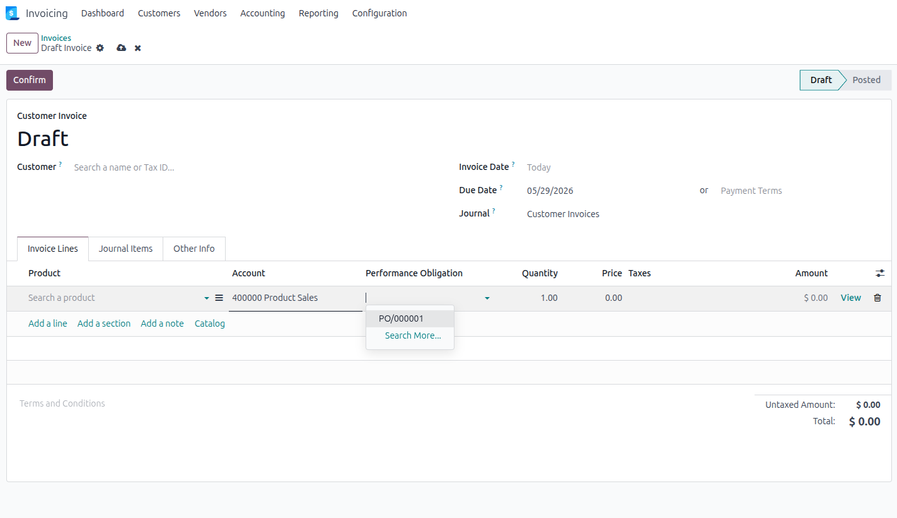
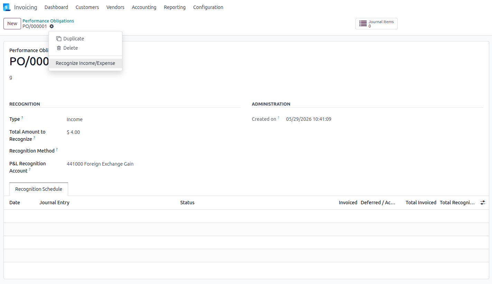
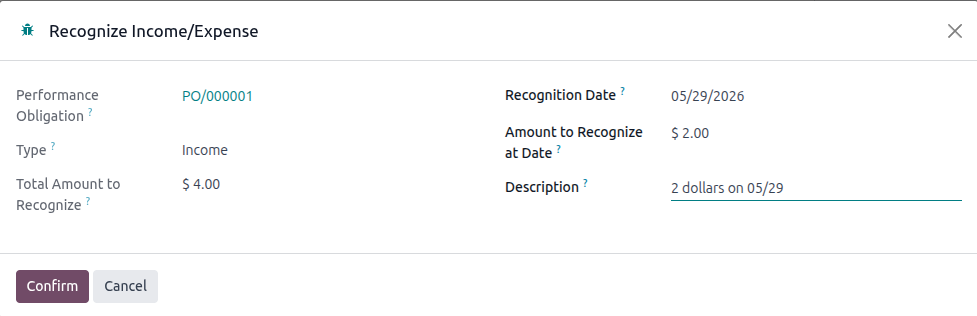

## Prerequisites

The user must belong to the **Show Full Accounting Features** group to access
the *Performance Obligations* menu and the configuration settings.

## Create a performance obligation

Go to *Invoicing > Accounting > Performance Obligations*.

Create a new obligation: choose the type (income or expense), and enter the
total amount to be recognized over the obligation's lifetime.

## Link invoices to the obligation

Open an invoice and navigate to the relevant journal items. Set the
**Performance Obligation** field on each line to link it to the obligation.

## Recognize income or expense manually

From the obligation form, click **Recognize Income** (or **Recognize Expense**).

In the wizard, enter:

- the **cumulative amount** to recognize at the given date,
- a **description** for the journal entry.

Confirm: a draft accrual or deferral entry is created with `auto_post = at_date`.

## Generate a recognition schedule automatically

> This feature requires the `account_perf_obligation_start_end_dates` module.
> The **Generate Schedule Entries** button will not appear with the base module alone.

From the obligation form, click **Generate Schedule Entries**.

The module creates one draft recognition entry per future period until the end
of the obligation, based on the configured recognition method.

> Running this action again deletes existing **draft** entries and regenerates
> them. Already **posted** entries are always preserved.

## Monitor and review entries

Use the **Journal Items** smart button on the obligation form to review all
accounting entries linked to the obligation.

## Process obligations flagged for regeneration

> This feature requires the `account_perf_obligation_start_end_dates` module.

When a relevant change is detected (total amount, recognition method, or a
linked journal item), the obligation is automatically flagged via
**Schedule Needs Regeneration**.

To process flagged obligations:

1. Go to *Invoicing > Accounting > Performance Obligations*.
2. Apply the **Needs Regeneration** filter.
3. Select the obligations to process.
4. Run the **Regenerate Schedule** action from the *Action* menu.

## Negative obligations

Set a negative `Total Amount` to model a revenue reversal (credit note) or a
negative expense correction. The recognition engine automatically swaps the
debit and credit balance-sheet accounts — no additional configuration is needed.

The amount entered in the recognition wizard must carry the **same sign** as
the total amount (or be zero, which always represents full deferral).
