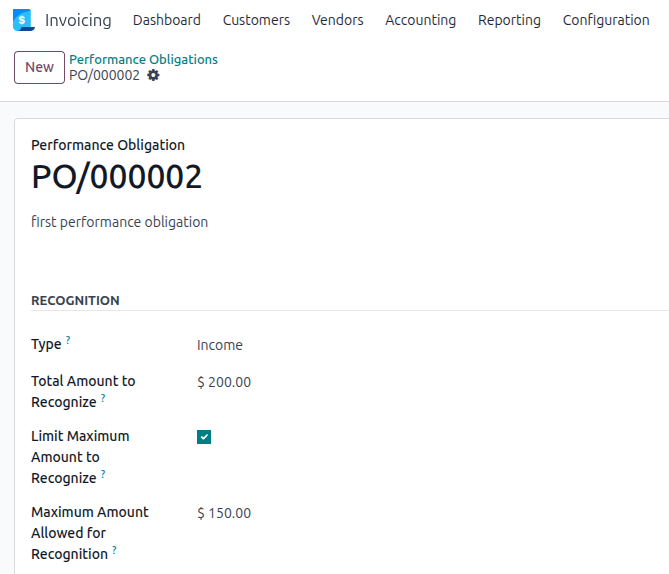

## Set a recognition cap

Open a performance obligation and tick **Limit Maximum Amount to Recognize**.

Enter the **Maximum Amount Allowed for Recognition**.

The obligation is automatically flagged for schedule regeneration. If
`account_perf_obligation_auto_schedule` is installed, the job runs in the
background. Otherwise, go to *Invoicing > Accounting > Performance Obligations*,
apply the **Needs Regeneration** filter, select the obligations, and run
**Regenerate Schedule** from the *Action* menu.

## Find capped obligations

In the *Performance Obligations* list view, use the **Capped** filter to
display only obligations with an active cap.

## Manual recognition with a cap

When using the **Recognize Income** (or **Recognize Expense**) wizard, a
validation error is raised if the entered amount exceeds the cap in absolute
terms. Adjust the amount to stay within the allowed limit.
