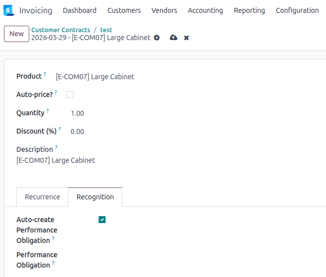

## Prerequisites

The user must belong to the **Show Full Accounting Features** group to access
the *Revenue Recognition* tab on the contract line form and the *Performance
Obligations* smart button on the contract.

## Contract line setup

On each contract line that should generate a performance obligation,
tick **Auto-create Performance Obligation**.

Optionally, set an **Income Account** (sale contracts) or **Expense Account**
(purchase contracts) on the product. If set, this account is copied to the
obligation's *P&L Recognition Account*, overriding the default from the
accounting configuration. Fiscal position mappings are applied automatically.
