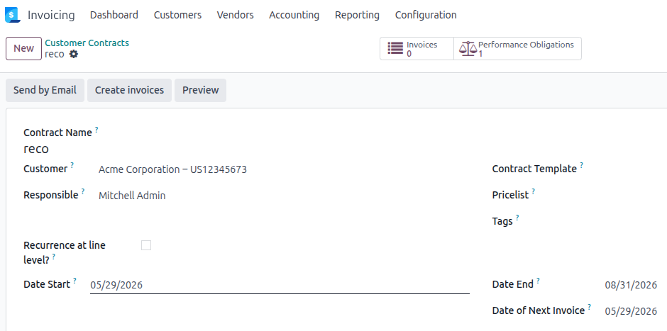

## Create an obligation from a contract line

Create or edit a contract line and tick **Auto-create Performance Obligation**.
Save: the obligation is created automatically with the contract line's start
and end dates and the computed total amount.

Use the **Performance Obligations** smart button on the contract form to
review all obligations linked to that contract.

## Cancel a contract line

When a contract line is cancelled, its linked obligation is frozen
automatically at the already-invoiced amount (or set to zero if nothing
has been invoiced yet).

Run **Process Pending Regenerations** from *Invoicing > Accounting >
Performance Obligations* to generate the corresponding adjustment entries,
or install `account_perf_obligation_auto_schedule` to have this handled
automatically in the background.

## Delete a contract line

If posted accounting entries are linked to the obligation, deletion is
**blocked**. Reverse those entries first, then delete the contract line.

Draft entries linked to the obligation are deleted automatically before
the obligation and the contract line are removed.

## Invoicing

When Odoo generates a recurring invoice from the contract, the performance
obligation is automatically copied to each invoice line produced from a
contract line that carries an obligation. No manual action is required.
