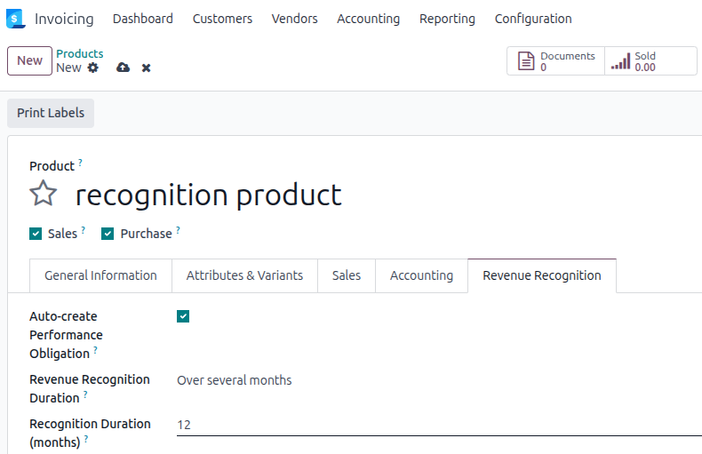

## Prerequisites

The user must belong to the **Show Full Accounting Features** group to access
the *Revenue Recognition* tab on the product form and the *Performance
Obligations* smart button on the sale order.

## Product setup

On each product that should generate a performance obligation when sold,
open the **Revenue Recognition** tab and configure:

- Tick **Auto-create Performance Obligation**.
- Select a **Revenue Recognition Duration** method:

  - *At once*: the full amount is recognized on the order confirmation date.
  - *Over several months*: enter the number of months in the
    **Recognition Duration (months)** field.
  - *Over several days*: enter the number of days in the
    **Recognition Duration (days)** field.

Optionally, set an **Income Account** on the product. If set, this account
is copied to the obligation's *P&L Recognition Account*, overriding the
default from the accounting configuration. Fiscal position mappings are
applied automatically.
