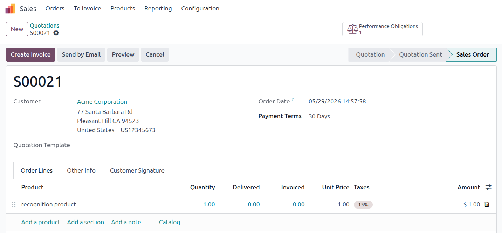

## Prerequisites

The user must belong to the **Show Full Accounting Features** group to access
the *Performance Obligations* smart button and the recognition actions on the
sale order form.

## Confirm a sale order

Confirm a sale order containing lines with products configured for automatic
obligation creation. An obligation is created for each qualifying line with
dates computed as follows:

- *At once*: start and end date are both set to the order confirmation date.
- *Over several months*: start date is the confirmation date; end date is
  the confirmation date plus the configured number of calendar months.
- *Over several days*: start date is the confirmation date; end date is
  the confirmation date plus the configured number of days.

Use the **Performance Obligations** smart button on the sale order form to
review all obligations linked to that order.

## Cancel a sale order

When a sale order is cancelled, all linked obligations are frozen
automatically at the already-invoiced amount (or set to zero if nothing
has been invoiced yet).

Run **Process Pending Regenerations** from *Invoicing > Accounting >
Performance Obligations* to generate the corresponding adjustment entries,
or install `account_perf_obligation_auto_schedule` to have this handled
automatically in the background.

## Re-confirm a cancelled order

When a cancelled order is re-confirmed, existing obligations are updated
in place with the recomputed dates, current line subtotal, and recomputed
P&L account. No duplicate obligation is created.
