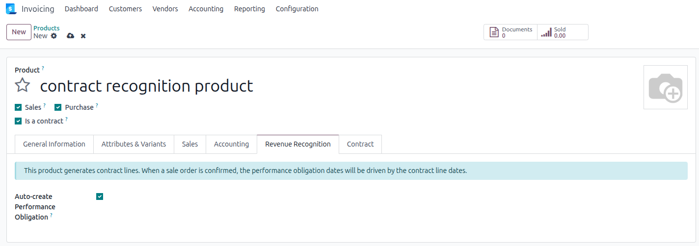

## Prerequisites

The user must belong to the **Show Full Accounting Features** group to access
the *Revenue Recognition* tab on the product.

## Product setup

On each contract product that should generate a performance obligation when
sold, open the **Revenue Recognition** tab and tick
**Auto-create Performance Obligation**.

When both **Auto-create Performance Obligation** and **Is a Contract Product**
are enabled, an info banner is displayed on the product form to indicate that
the obligation dates will be driven by the contract line dates. The
*Recognition Duration* fields are hidden and not required.

No recognition method needs to be configured on such products.
